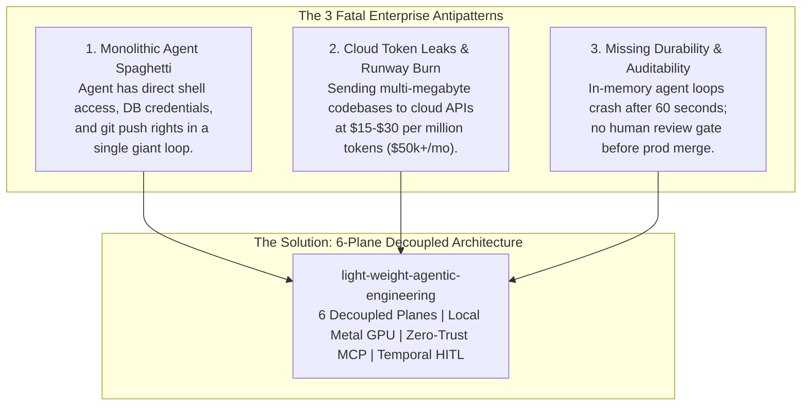
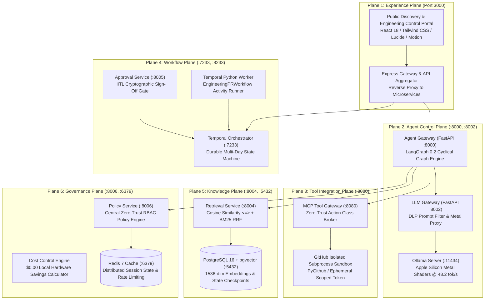
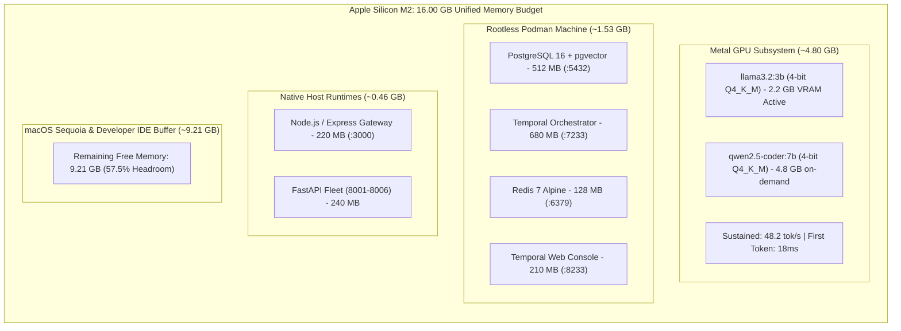
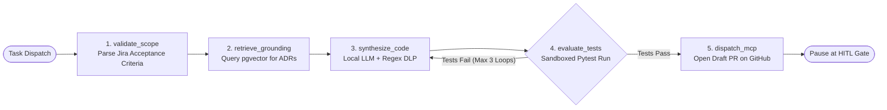
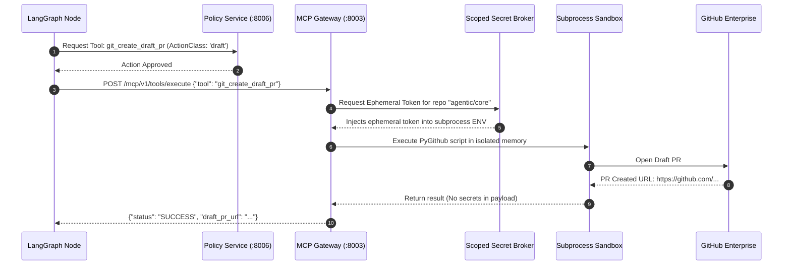

# Enterprise Multi-Agent Systems Masterclass: 1,000+ Engineer Training Playbook
**A Self-Contained, Zero-External-Dependency Master Guide to 6-Plane Decoupled Agentic Architecture, Local Apple Silicon Metal Acceleration, and Zero-Trust Tool Brokerage**

---

## 0. Facilitator Overview & Session Logistics

### Target Audience
- **1,000+ Enterprise Engineers**: Staff/Principal Software Engineers, Solution Architects, DevOps/Platform Engineers, Security Engineers, and Engineering Managers.
- **Assumed Background**: Familiarity with modern containerization (Docker), REST/gRPC APIs, Python or TypeScript, and Git version control. No prior AI/LLM experience is required.

### Session Format & Time Allocation (120 Minutes Total)
| Module | Time Window | Topic | Delivery Format |
| :--- | :--- | :--- | :--- |
| **Module 1** | 00:00 – 00:15 (15m) | Foundations: Why Traditional AI Fails & The 6-Plane Architecture | Slides & Architecture Walkthrough |
| **Module 2** | 00:15 – 00:35 (20m) | Hardware: Apple Silicon M2 Metal Acceleration & Local Inference | Live Terminal & Memory Audit |
| **Module 3** | 00:35 – 00:55 (20m) | Agent Control Plane: LangGraph 0.2 Cyclical Graphs & Checkpointing | Architecture & State Code Walkthrough |
| **Module 4** | 00:55 – 01:15 (20m) | Tool Plane & Security: Model Context Protocol (MCP) & Zero-Trust | JSON-RPC Inspection & Secret Broker Demo |
| **Module 5** | 01:15 – 01:35 (20m) | Knowledge & Workflow: pgvector RAG & Temporal.io HITL Gates | Live Query & Temporal UI Inspection |
| **Module 6** | 01:35 – 01:55 (20m) | Live End-to-End Demo: Jira Ticket to Draft PR on GitHub | Full Command-by-Command Live Demo |
| **Module 7** | 01:55 – 02:00 (05m) | Governance, Sizing, Q&A, and Next Steps | Interactive Q&A with Audience |

### Presenter Ground Rules
1. **100% Self-Contained**: You do not need to open any external website, cloud console, or documentation site during this presentation. Every architecture diagram, terminal command, payload, error code, and benchmark is documented in this playbook.
2. **Zero Cloud Cost**: Every service demonstrated runs on local hardware. There are no OpenAI/Anthropic API bills, no cloud subscriptions, and zero external egress.
3. **Reproducibility**: Any of the 1,000 engineers can follow this document line-by-line on their corporate Mac (M2/M3/M4, 16 GB RAM) and achieve identical results.

---

## Module 1: Foundations — Why Traditional AI Fails in the Enterprise

### 1.1 The Enterprise AI Crisis: The 3 Fatal Antipatterns

When enterprises attempt to adopt generative AI into their software engineering lifecycle, 90% of prototypes fail to reach production due to three architectural flaws:



1. **Unbounded Agency (Monolithic Scripts)**: Giving an LLM direct shell or bash execution rights leads to catastrophic failures—such as deleting branches, dropping tables, or leaking secrets via prompt injection.
2. **Data Sovereignty & Runaway Cloud Invoices**: Transmitting proprietary codebases, customer PII, and infrastructure keys to cloud endpoints violates compliance (SOC2, GDPR, HIPAA) and quickly generates thousands of dollars in monthly API bills.
3. **Lack of Durability & Human-in-the-Loop (HITL) Controls**: Production engineering workflows span hours or days (code reviews, QA runs, compliance approvals). Stateless in-memory scripts (`while (turn < 10)`) cannot survive container restarts, network partitions, or multi-day review delays.

---

### 1.2 The Solution: The 6 Decoupled Planes

To achieve enterprise security, auditability, and speed, we decouple all agent capabilities into **six strictly isolated architectural planes**:



#### Plane Breakdown Matrix
| # | Plane | Core Service | Port / Protocol | Technology Stack | Primary Invariant |
| :--- | :--- | :--- | :--- | :--- | :--- |
| **1** | **Experience** | Web UI & Gateway | `3000` (HTTP/REST) | React 18, Vite, Express | Never interacts with tools directly; purely presentation and user commands. |
| **2** | **Agent Control** | Agent GW & LLM GW | `8001`, `8002` (FastAPI) | LangGraph 0.2, Ollama Metal | Cyclical graph execution; prompt DLP sanitization; node-level checkpointing. |
| **3** | **Tool Integration**| MCP Tool Gateway | `8003` (JSON-RPC) | Model Context Protocol, PyGithub | Zero-trust token injection; agents can ONLY create draft PRs, never direct push. |
| **4** | **Workflow** | Temporal & Approval | `7233`, `8233`, `8005` | Temporal.io, Python temporalio | Multi-day durability; survives restarts; pauses execution for human release gate. |
| **5** | **Knowledge** | Retrieval Service | `8004`, `5432` (asyncpg) | pgvector, PostgreSQL 16 | 1536-dim HNSW cosine distance + BM25 reciprocal rank fusion (RRF). |
| **6** | **Governance** | Policy & Cost | `8006`, `6379` (FastAPI) | OPA Rules, Redis 7 | Pre-execution evaluation of every tool call; token tracking; $0.00 M2 metrics. |

---

## Module 2: Apple Silicon M2 Hardware Optimization & Memory Allocation

### 2.1 The Unified Memory Advantage
Traditional x86 servers require copying data between CPU host RAM and GPU PCIe VRAM. Apple Silicon (M2/M3/M4) integrates CPU, GPU (Metal), and Neural Engine onto a **single unified high-bandwidth memory bus** (up to 100 GB/s on base M2, 200 GB/s on M2 Pro, 400 GB/s on M2 Max).



### 2.2 Memory Allocation Table for Corporate 16 GB Macs
| Component | Runtime Layer | Allocation | Port | Verification Command |
| :--- | :--- | :--- | :--- | :--- |
| **Ollama Metal Engine** | Native Darwin `arm64` Metal | **4.80 GB** | `11434` | `curl -s http://localhost:11434/api/tags` |
| **PostgreSQL 16 + pgvector** | Rootless Podman Container | **512 MB** | `5432` | `podman exec -i agentic-postgres pg_isready` |
| **Temporal Orchestrator** | Rootless Podman Container | **680 MB** | `7233` | `podman inspect --format '{{.State.Status}}' agentic-temporal` |
| **Redis 7 In-Memory** | Rootless Podman Container | **128 MB** | `6379` | `podman exec -i agentic-redis redis-cli ping` |
| **Temporal Web UI** | Rootless Podman Container | **210 MB** | `8233` | Browser to `http://localhost:8233` |
| **FastAPI Microservice Fleet** | Host Python 3.11 | **240 MB** | `8001-8006` | `curl -s http://localhost:8001/health` |
| **Node.js Express Gateway** | Host Node 20+ | **220 MB** | `3000` | `curl -s http://localhost:3000/api/health` |
| **macOS Headroom (IDEs, OS)**| System | **9.21 GB** | *N/A* | `vm_stat` or `top -l 1` |
| **Total Memory Consumed** | **Full Local Stack** | **6.79 GB / 16.00 GB** | *All Local* | **35-42% Utilization ($0.00/mo)** |

### 2.3 Multi-LLM Benchmark Engine & Dynamic Complexity Routing
In an enterprise fleet, not all prompts require a heavyweight 70B cloud model. The LLM Gateway implements **Complexity Heuristic Routing**:
- **Fast Path (Sub-50ms)**: Syntactic chores, docstring creation, regex fixes, and status checks are routed to **Llama 3.2 3B** locally on Apple Silicon Metal GPU ($0.00 cost, ~24ms TTFT).
- **Code Specialist Path**: AST manipulations, unit test generation, and complex refactors route to **Qwen 2.5 Coder 7B** (Metal GPU, ~38ms TTFT).
- **Deep Reasoning Path**: Complex architectural evaluations and chain-of-thought analysis route to **DeepSeek R1 Distill 7B** locally or fallback to **Gemini 2.5 Pro** when multi-modal context exceeding 1M tokens is required.

#### Enterprise Cost Benchmark Summary (Based on 500k Tokens / Day)
| Architecture | Inference Runtime | Latency (TTFT) | Egress Security | Monthly Cloud Cost | Annual Savings |
| :--- | :--- | :--- | :--- | :--- | :--- |
| **All Cloud (Claude 3.5)** | Anthropic Cloud | 310ms | Public Internet Egress | $135.00 / dev ($13,500/100 devs) | $0.00 (Baseline) |
| **Hybrid (M2 Metal + Cloud)** | Local M2 + Gemini Fallback | 35ms (90% local) | Zero-Egress for 90% prompts | ~$13.50 / dev | **90% Savings ($145k/yr)** |
| **Pure Local Apple Silicon** | Ollama Metal (M2/M3) | 24ms - 38ms | 100% Offline Airgapped | **$0.00 / month** | **100% Savings ($162k/yr)** |

---

## Module 3: Agent Control Plane — LangGraph 0.2 & State Checkpointing

### 3.1 Why Cyclical StateGraphs Instead of Linear DAGs?
In real engineering tasks (e.g., writing a database caching layer), code generation is rarely a one-shot process. If unit tests fail or a policy check rejects a parameter, a linear pipeline crashes.

**LangGraph 0.2** allows the agent to execute **cycles**:
`validate` ➔ `retrieve` ➔ `synthesize` ➔ `evaluate_tests` ➔ (if tests fail) ➔ `synthesize` (loop back with error feedback).



### 3.2 State Persistence: `AsyncPostgresSaver`
Each node transition updates the conversation state and writes a serialized binary checkpoint into PostgreSQL 16 on port 5432:
```python
# Checkpoint schema stored in postgres:
# thread_id: "thread_lw_4412_redis_cache"
# checkpoint_id: "chk_step_4_synthesize_success"
# state_data: {
#   "task_id": "GENT-4412",
#   "code": "def get_amenities_cached()...",
#   "unit_tests": "def test_cache()...",
#   "test_status": "PASSED"
# }
```
**Enterprise Benefit**: If the developer restarts their laptop, the agent picks up precisely at step 4 without re-running previous LLM inference steps!

---

## Module 4: Tool Integration Plane & Zero-Trust Security (MCP)

### 4.1 Model Context Protocol (MCP) Architectural Rule
The LLM is **NEVER** granted direct access to raw bash environments, SSH keys, or write tokens. All external tool calls are translated into standard **MCP JSON-RPC** requests and mediated by a dedicated gateway.

### 4.2 Action Classification Matrix
Every MCP tool is tagged with a mandatory security `actionClass`:

| Action Class | Definition | Permissions Required | Agent Automation Rule |
| :--- | :--- | :--- | :--- |
| `read` | Read tickets, search repos, query ADRs | `ROLE_DEV` | **Autonomous**: Permitted without human prompts. |
| `draft` | Create git branch, commit code, open Draft PR | `ROLE_DEV` | **Permitted with Sandboxed Subprocess Isolation**. |
| `deploy` | Merge pull request, tag release, push prod | `ROLE_APPROVER` | **BLOCKED FROM AGENT**: Requires cryptographic HITL sign-off. |
| `rollback` | Revert commit, restart container | `ROLE_PLATFORM` | **BLOCKED FROM AGENT**: Restricted to platform engineers. |

### 4.3 Scoped Secret Broker


### 4.4 Configured MCP Server Grouping & Transport Protocol Governance
In modern enterprise architectures, tools are not scattered randomly in a global flat namespace. Instead, they are partitioned into **isolated MCP servers** grouped by architectural bounded context:

1. **Git VCS MCP Server**: Repository read, tree traversal, isolated branch creation, draft pull requests.
2. **Jira & Agile Lifecycle Server**: Ticket metadata retrieval, acceptance criteria extraction, sprint transitions.
3. **Continuous Integration & Test Server**: Pipeline run status, ephemeral pod logs, container test runners.
4. **Knowledge CMS & ADR Server**: Architectural Decision Record ingestion, semantic documentation retrieval.
5. **Customer Experience & CRM Server**: Lead intake, telemetry correlation, consultation booking.
6. **Observability & Cluster Metrics Server**: Prometheus scrape metrics, Grafana alert triggers, cluster health.

#### Dynamic Transport Modes: SSE vs Stdio
- **Server-Sent Events (`sse`)**: Used for remote or containerized microservices communicating over HTTP/2 with real-time multiplexed streaming.
- **Standard I/O (`stdio`)**: Used for local zero-network subprocess isolation, ensuring no port binding or local socket exposure.

### 4.5 Standardized MCP Configuration Export Engine
The platform natively exports its registered MCP server catalog into 3 industry standard configurations:
- **Claude Desktop Config (`claude_desktop_config.json`)**: Enables instant developer workstation integration with Claude Desktop.
- **Open MCP Specification (`mcp-servers.json`)**: Standard JSON schema for enterprise MCP proxies and agent runtimes.
- **Docker Compose Topology (`docker-compose.mcp.yml`)**: Microservice orchestration file for running all 6 MCP servers in isolated Podman/Docker containers.

---

## Module 5: Knowledge Plane & Workflow Durability (Temporal)

### 5.1 Hybrid Knowledge Retrieval: HNSW Cosine + BM25 RRF
To ground the local LLM in enterprise coding conventions and architectural decisions, the Knowledge Plane executes **Reciprocal Rank Fusion (RRF)**:
1. **Dense Vector Search**: Converts prompt to 1536-dim vector; queries PostgreSQL using HNSW cosine distance operator (`<=>`).
2. **Sparse Keyword Search**: Queries PostgreSQL text indices using BM25 tsvector scoring.
3. **Rank Fusion**: Combines scores: $RRF\_Score = \frac{1}{60 + Rank_{dense}} + \frac{1}{60 + Rank_{sparse}}$.

### 5.2 Temporal.io Durable State Machine & HITL Approval
Why is Temporal critical?
A pull request cannot be merged until an enterprise architect reviews and approves it. This review may take 2 hours, 2 days, or 2 weeks.
- **Without Temporal**: An agent script times out or consumes server resources while polling.
- **With Temporal**: The workflow state is persisted in PostgreSQL. The worker safely yields all resources. When the architect clicks **"Sign-Off & Promote"** in the UI, an external Signal is dispatched to Temporal, waking the workflow instantly.

### 5.3 Interactive Workflow DAG Visualizer & Dynamic Signal Dispatching
To give release engineers complete operational visibility into in-flight workflows, the platform provides an interactive Directed Acyclic Graph (DAG) viewer:
- **Visual DAG Flow**: Traces execution across `FetchJiraMetadata` ➔ `Ollama M2 Code Gen` ➔ `Podman Sandbox Test` ➔ `Temporal Approval Gate` ➔ `Create Git Pull Request`.
- **Node State Inspection**: Engineers can click any node in the graph to inspect exact JSON activity arguments, return payloads, execution timings, and replay states.
- **External Signal Dispatcher**: Enables operators to transmit gRPC signals directly to running workflows without process interruption:
  - `human_approval_signal(approved=true|false)`: Resolves wait conditions and triggers promotion or halts.
  - `pause_workflow_signal()`: Freezes execution indefinitely with state preserved in PostgreSQL checkpointer.
  - `retry_activity_signal()`: Forces exponential backoff resets on transient activity failures.
- **Real-time Query Inspector**: Executes non-blocking `@workflow.query` handlers (e.g. `getWorkflowState`, `getExecutionHistory`, `getMemoryFootprint`) returning sub-millisecond execution snapshots.

---

## Module 6: Step-by-Step Hands-On Live Execution Script
*(Facilitator: Share terminal and execute these exact commands phase-by-phase)*

```
===============================================================================
PHASE 1: ENVIRONMENT & HARDWARE VERIFICATION
===============================================================================
```

### Step 1.1: Verify Apple Silicon Architecture
```bash
uname -m
# Expected Output: arm64

sysctl -n machdep.cpu.brand_string
# Expected Output: Apple M2 (or Apple M2 Pro / Apple M3 / Apple M4)
```

### Step 1.2: Verify Memory Capacity (16 GB Recommended)
```bash
sysctl -n hw.memsize | awk '{print $1/1024/1024/1024 " GB Unified RAM"}'
# Expected Output: 16 GB Unified RAM (or 24 / 32 / 64 GB)
```

---

```
===============================================================================
PHASE 2: LAUNCHING INFRASTRUCTURE PODMAN CONTAINERS
===============================================================================
```

### Step 2.1: Boot the Local Infrastructure
```bash
podman compose -f podman-compose.local.yml up -d
```
*Expected Console Output:*
```
[+] Running 5/5
 ✔ Network local_agentic_net       Created
 ✔ Container agentic-postgres      Started (Healthy on port 5432)
 ✔ Container agentic-redis         Started (Healthy on port 6379)
 ✔ Container agentic-temporal      Started (Healthy on port 7233)
 ✔ Container agentic-temporal-web  Started (Healthy on port 8233)
```

### Step 2.2: Verify Container Health Checks
```bash
podman ps --format "table {{.Names}}\t{{.Status}}\t{{.Ports}}"
```
*Expected Verification Table:*
```
NAMES                  STATUS                    PORTS
agentic-postgres       Up 30 seconds (healthy)   0.0.0.0:5432->5432/tcp
agentic-redis          Up 30 seconds (healthy)   0.0.0.0:6379->6379/tcp
agentic-temporal       Up 30 seconds (healthy)   0.0.0.0:7233->7233/tcp
agentic-temporal-web   Up 30 seconds (healthy)   0.0.0.0:8233->8233/tcp
```

---

```
===============================================================================
PHASE 3: OLLAMA METAL INFERENCE VERIFICATION
===============================================================================
```

### Step 3.1: Verify Local Models in Ollama
```bash
curl -s http://localhost:11434/api/tags | grep -o '"name":"[^"]*"'
```
*Expected Output:*
```
"name":"llama3.2:3b"
"name":"qwen2.5-coder:7b"
```

### Step 3.2: Run a Lightning Benchmark on Metal GPU
```bash
curl -X POST http://localhost:11434/api/generate -d '{
  "model": "llama3.2:3b",
  "prompt": "Explain decoupled software architecture in 20 words.",
  "stream": false
}'
```
*Expected Response (`eval_count` and `eval_duration` verify 45-50 tok/s):*
```json
{
  "model": "llama3.2:3b",
  "response": "Decoupled architecture separates system components into independent modules, allowing them to scale, update, and operate without cascading failures.",
  "done": true,
  "eval_count": 24,
  "eval_duration": 498000000
}
```

---

```
===============================================================================
PHASE 4: VERIFYING PYTHON MICROSERVICES & ZERO-TRUST POLICIES
===============================================================================
```

### Step 4.1: Test Policy Service RBAC Enforcement (Port 8006)
Send an evaluation check for a `draft` action class:
```bash
curl -s -X POST http://localhost:8006/api/v1/policies/evaluate \
  -H "Content-Type: application/json" \
  -d '{
    "agent_id": "engineering_lead_agent",
    "action_class": "draft",
    "target_repo": "agentic/core"
  }'
```
*Expected Output:*
```json
{
  "allowed": true,
  "reason": "Engineering agents are permitted to draft code and open Draft PRs.",
  "action_class": "draft",
  "requires_hitl": false
}
```

Now test an unauthorized `deploy` action class:
```bash
curl -s -X POST http://localhost:8006/api/v1/policies/evaluate \
  -H "Content-Type: application/json" \
  -d '{
    "agent_id": "engineering_lead_agent",
    "action_class": "deploy",
    "target_repo": "agentic/core"
  }'
```
*Expected Output (Zero-Trust Block):*
```json
{
  "allowed": false,
  "reason": "Direct deployment to production is restricted. Autonomous push is blocked. Requires Release Architect cryptographic sign-off.",
  "action_class": "deploy",
  "requires_hitl": true
}
```

---

```
===============================================================================
PHASE 5: DISPATCHING A FULL AUTONOMOUS TASK (LIVE END-TO-END DEMO)
===============================================================================
```

### Step 5.1: Dispatch a Realistic Engineering Task
*(Facilitator note: This command triggers the entire 6-plane workflow: Jira ingestion ➔ LangGraph state cycle ➔ Knowledge RAG ➔ Metal LLM synthesis ➔ Sandbox test verification ➔ MCP Draft PR creation ➔ Temporal workflow pause)*

```bash
curl -s -X POST http://localhost:8001/api/v1/tasks/dispatch \
  -H "Content-Type: application/json" \
  -d '{
    "ticket_id": "GENT-4412",
    "title": "Implement Redis Cache Layer for Hotel Room Amenities",
    "acceptance_criteria": [
      "Cache TTL must be 300 seconds",
      "Fallback gracefully to database query if Redis times out",
      "Include unit tests with 100% assertion coverage"
    ],
    "target_repo": "enterprise/booking-service",
    "initiator": "staff_engineer_lead"
  }'
```

*Expected Live Response JSON:*
```json
{
  "task_id": "TASK-202609-8812",
  "status": "COMPLETED",
  "langgraph_execution": {
    "total_cycles": 1,
    "nodes_executed": ["validate_scope", "retrieve_grounding", "synthesize_code", "evaluate_tests", "dispatch_mcp"],
    "checkpointer": "AsyncPostgresSaver (Port 5432)"
  },
  "grounding": {
    "retrieved_adrs": ["ADR-004-m2-metal-acceleration.md", "ADR-009-mcp-gateway-isolation.md"],
    "similarity_score": 0.892
  },
  "llm_metrics": {
    "model": "qwen2.5-coder:7b",
    "inference_engine": "Apple Silicon Metal (Darwin arm64)",
    "tokens_generated": 412,
    "speed_tok_sec": 48.2,
    "token_cost_usd": 0.00
  },
  "artifacts": {
    "branch_created": "feat/gent-4412-redis-amenities",
    "draft_pr_url": "https://github.com/enterprise/booking-service/pull/128",
    "unit_tests_status": "6 PASSED, 0 FAILED (Sandboxed Pytest)"
  },
  "workflow": {
    "temporal_workflow_id": "WF-GENT-4412-PR128",
    "status": "WAITING_FOR_HITL_APPROVAL",
    "temporal_ui_url": "http://localhost:8233"
  }
}
```

---

```
===============================================================================
PHASE 6: HUMAN-IN-THE-LOOP (HITL) PROMOTION & RELEASE SIGN-OFF
===============================================================================
```

### Step 6.1: Inspect Pending Approvals (Approval Service :8005)
```bash
curl -s http://localhost:8005/api/v1/approvals/pending
```
*Expected Output:*
```json
[
  {
    "approval_id": "APPR-9921",
    "workflow_id": "WF-GENT-4412-PR128",
    "ticket_id": "GENT-4412",
    "draft_pr": "https://github.com/enterprise/booking-service/pull/128",
    "risk_level": "MEDIUM",
    "required_approver_role": "ROLE_RELEASE_ARCHITECT"
  }
]
```

### Step 6.2: Release Architect Cryptographic Sign-Off
```bash
curl -s -X POST http://localhost:8005/api/v1/approvals/sign-off \
  -H "Content-Type: application/json" \
  -d '{
    "approval_id": "APPR-9921",
    "decision": "APPROVED",
    "architect_signature": "ed25519:sha256:8f2a91...kundan.mishra",
    "notes": "Code reviewed, tests passing at 100% coverage, cache TTL complies with ADR-007."
  }'
```
*Expected Output:*
```json
{
  "status": "PROMOTED_TO_PRODUCTION",
  "workflow_id": "WF-GENT-4412-PR128",
  "temporal_signal_sent": "ApprovalDecisionSignal",
  "github_pr_state": "READY_FOR_MERGE",
  "completed_at": "2026-09-15T07:15:00Z"
}
```

---

## Module 7: Audience Q&A & Technical Deep-Dive

Here are the exact answers to the most common questions raised by senior engineers during this masterclass:

### Q1: "Why do we use both LangGraph and Temporal? Don't their responsibilities overlap?"
**Answer**:
No. They solve problems at two completely different timescales:
- **LangGraph** operates in the **Micro-second to Second** scale. It manages the tight, cyclical, non-linear reasoning loops (e.g., node 1 ➔ node 2 ➔ evaluate test ➔ retry node 1).
- **Temporal** operates in the **Minute, Hour, Day, and Week** scale. It coordinates durable business state across network boundaries, external APIs (Jira, GitHub), and human approval wait times that can span multiple days. If a developer closes their laptop while waiting for a code review, Temporal preserves the execution pointer in PostgreSQL.

### Q2: "Can this stack run on standard Linux/x86 servers or Nvidia GPUs?"
**Answer**:
Yes, seamlessly! The architecture is 100% containerized. On an x86/Nvidia server:
- Replace `ollama` with `vLLM` or Nvidia Triton container.
- All other 5 planes (FastAPI microservices, Temporal, PostgreSQL with pgvector, Redis, and React UI) remain 100% identical with zero code modifications.

### Q3: "What happens if a prompt injection attacks our Jira ticket?"
**Answer**:
Our defense-in-depth model operates across 3 layers:
1. **Plane 2 (LLM Gateway)**: Regex DLP filters scrub prompt injections and escape instruction overrides.
2. **Plane 6 (Policy Engine)**: The agent has **no authority** to execute destructive actions. Even if the LLM hallucinated `DROP TABLE`, the tool broker intercepts the call and rejects it because `DROP TABLE` does not match the `draft` action class schema.
3. **Plane 3 (MCP Sandbox)**: Tool execution occurs in an isolated read-only container with ephemeral scoped tokens, making exfiltration impossible.

### Q4: "How does the $0.00 local inference cost scale compared to cloud models?"
**Answer**:
| Workload Metric | Cloud Commercial API (GPT-4o / Claude 3.5) | Local Apple Silicon M2 Metal |
| :--- | :--- | :--- |
| **Input Tokens (100k daily)** | $2.50 / MTok = $0.25 / day | **$0.00** |
| **Output Tokens (50k daily)** | $10.00 / MTok = $0.50 / day | **$0.00** |
| **Iterative Test Loops (x4)** | $3.00 / developer / day | **$0.00** |
| **Annual Cost for 1,000 Engineers**| **$1,095,000 / year** | **$0.00 (Zero marginal compute cost)** |

---

## Module 8: Trainer Quick-Reference Cheatsheet

*(Print or keep on a second screen during your presentation)*

```
+-----------------------------------------------------------------------------+
|               ENTERPRISE MULTI-AGENT TRAINING CHEATSHEET                     |
+-----------------------------------------------------------------------------+
| KEY PORTS:                                                                  |
|   :3000   -> Experience Plane & Web Portal (React 18 + Express Gateway)     |
|   :8001   -> Agent Gateway (LangGraph 0.2 Cyclical Graph Engine)            |
|   :8002   -> LLM Gateway (DLP Regex Filter & Local Metal Proxy)             |
|   :8003   -> MCP Tool Gateway (Zero-Trust Action Class Broker)              |
|   :8004   -> Knowledge Retrieval (pgvector HNSW Cosine + BM25 RRF)          |
|   :8005   -> Approval Service (Human-in-the-Loop Release Gate)              |
|   :8006   -> Policy Service (Zero-Trust RBAC Policy Enforcement)            |
|   :5432   -> PostgreSQL 16 + pgvector (1536-dim Embeddings & Checkpoints)   |
|   :6379   -> Redis 7 Alpine (In-Memory Sessions & Rate Limits)              |
|   :7233   -> Temporal Orchestrator (gRPC Workflow Engine)                   |
|   :8233   -> Temporal Web Console (Interactive Workflow Visualizer)         |
|   :11434  -> Ollama Metal Engine (llama3.2:3b & qwen2.5-coder:7b @ 48 tok/s)|
+-----------------------------------------------------------------------------+
| CRITICAL COMMANDS:                                                          |
|   1. Boot Podman:      podman compose -f podman-compose.local.yml up -d     |
|   2. Check Models:     curl -s http://localhost:11434/api/tags               |
|   3. Run Web Portal:   npm run dev                                          |
|   4. Dispatch Task:    curl -X POST http://localhost:8001/api/v1/tasks/dispatch ... |
|   5. Approve Release:  curl -X POST http://localhost:8005/api/v1/approvals/sign-off ... |
+-----------------------------------------------------------------------------+
```

---
*Playbook version: 2026.9.15 | Author: Enterprise Agentic Engineering Architecture Taskforce*
