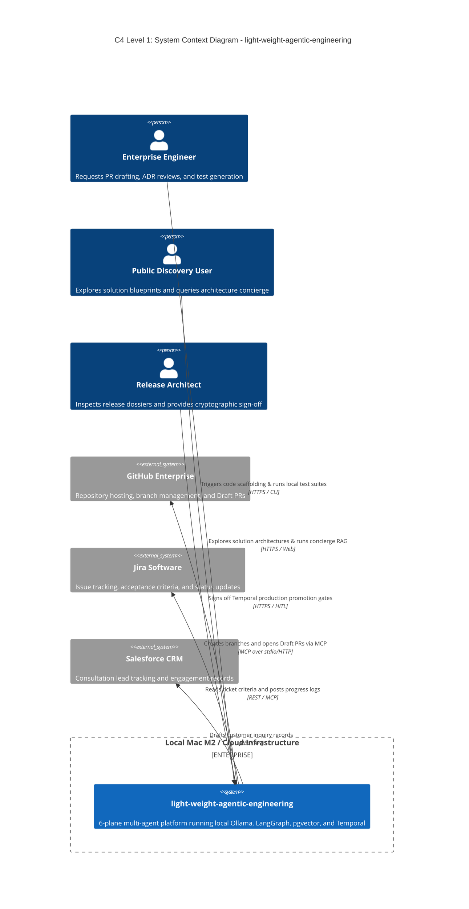
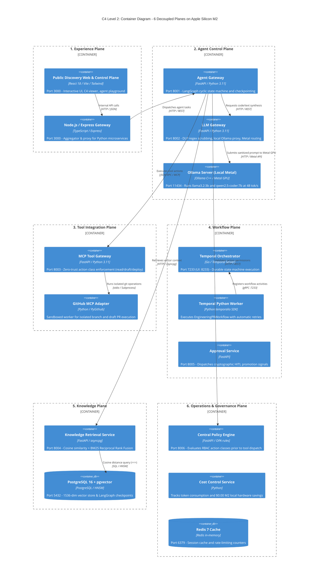
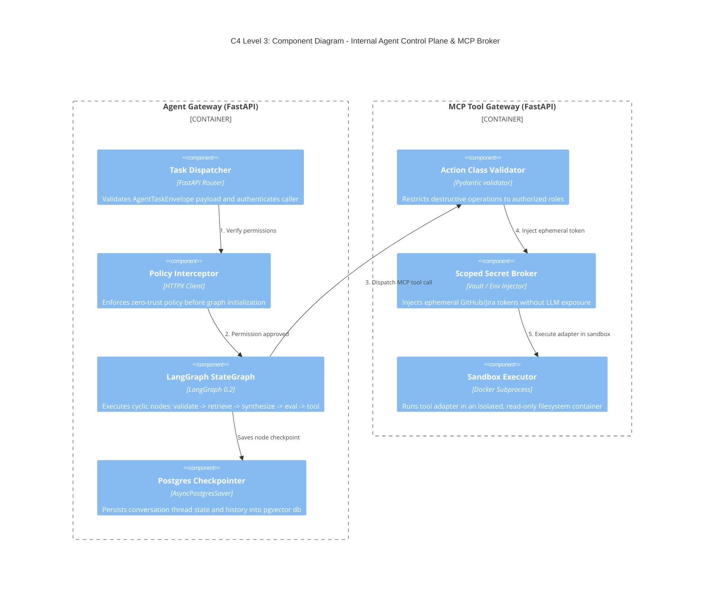
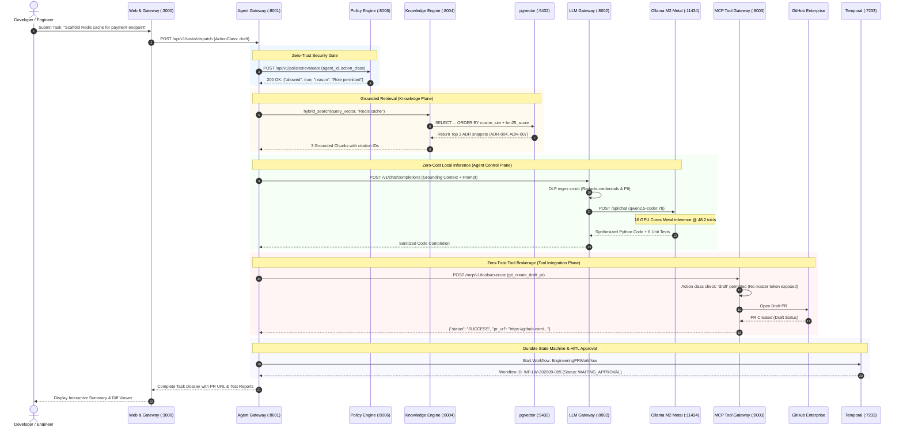

# 🍏 Apple Silicon Mac M2 Local Setup Guide & Architecture Manual
## `light-weight-agentic-engineering` Platform

This document is the definitive, step-by-step manual for provisioning, running, and verifying the complete **6-Plane Agentic Engineering Platform** locally on an **Apple Silicon Mac M2** (or M2 Pro, M2 Max, M3, M4) with zero cloud token expenditure during development.

---

## 📑 Table of Contents
1. [Target Architecture & Hardware Prerequisites](#1-target-architecture--hardware-prerequisites)
2. [C4 Architectural Diagrams & System Flows](#2-c4-architectural-diagrams--system-flows)
   - [C4 Level 1: System Context Diagram](#c4-level-1-system-context-diagram)
   - [C4 Level 2: Container Architecture (6 Planes)](#c4-level-2-container-architecture-6-planes)
   - [C4 Level 3: Component Diagram (Agent & Tool Gateways)](#c4-level-3-component-diagram-agent--tool-gateways)
   - [C4 Level 4: Mac M2 Deployment Topology & Memory Allocation](#c4-level-4-mac-m2-deployment-topology--memory-allocation)
   - [End-to-End Execution Sequence Flow](#end-to-end-execution-sequence-flow)
3. [One-Click Automated Shell Script Execution](#3-one-click-automated-shell-script-execution)
4. [Step-by-Step Manual Setup with Expected Output Comparison](#4-step-by-step-manual-setup-with-expected-output-comparison)
   - [Step 1: System Architecture & Hardware Verification](#step-1-system-architecture--hardware-verification)
   - [Step 2: Package Managers & Toolchain Installation](#step-2-package-managers--toolchain-installation)
   - [Step 3: Local Infrastructure Startup (Docker Compose)](#step-3-local-infrastructure-startup-docker-compose)
   - [Step 4: Pulling 4-bit Quantized Models into Ollama Metal Memory](#step-4-pulling-4-bit-quantized-models-into-ollama-metal-memory)
   - [Step 5: Database Seeding & pgvector Extension Verification](#step-5-database-seeding--pgvector-extension-verification)
   - [Step 6: Running the Full-Stack Agent Gateway & Web Portal](#step-6-running-the-full-stack-agent-gateway--web-portal)
   - [Step 7: Automated End-to-End Test Suite Execution](#step-7-automated-end-to-end-test-suite-execution)
5. [API Endpoint Verification Matrix](#5-api-endpoint-verification-matrix)
6. [Troubleshooting & Performance Tuning Guide](#6-troubleshooting--performance-tuning-guide)

---

## 1. Target Architecture & Hardware Prerequisites

### Hardware Requirements
- **Machine**: Apple Mac with Apple Silicon M2, M2 Pro, M2 Max, or newer (M3/M4 also fully supported).
- **Unified RAM**: 16 GB minimum recommended (Stack uses ~5.6 GB at peak inference).
- **Disk Storage**: At least 15 GB free for Docker volumes and Ollama model weights.
- **Operating System**: macOS Sonoma (14.x) or macOS Sequoia (15.x).

### Software Requirements
- **Homebrew**: `v4.2.0+`
- **Docker Desktop for Mac**: `v4.30.0+` (Apple Silicon build, with VirtioFS enabled)
- **Ollama for macOS**: Native Apple Silicon installer (utilizes Metal GPU acceleration)
- **Astral uv**: Python package manager (`v0.4.0+`)
- **Python**: `>= 3.11`
- **Node.js**: `v20.x+` & **pnpm**: `v9.x+`

---

## 2. C4 Architectural Diagrams & System Flows

### C4 Level 1: System Context Diagram



---

### C4 Level 2: Container Architecture (6 Planes)



---

### C4 Level 3: Component Diagram (Agent & Tool Gateways)



---

### C4 Level 4: Mac M2 Deployment Topology & Memory Allocation

```
┌─────────────────────────────────────────────────────────────────────────────┐
│                 APPLE SILICON MAC M2 HARDWARE (16 GB UNIFIED RAM)            │
├─────────────────────────────────────────────────────────────────────────────┤
│ macOS Sequoia / Sonoma (Darwin arm64)                                       │
│                                                                             │
│  ┌───────────────────────────────────────────────────────────────────────┐  │
│  │ Apple Silicon Metal GPU Subsystem (16 GPU Cores)                      │  │
│  │                                                                       │  │
│  │  [Ollama Server Process] (Metal Acceleration Active)                  │  │
│  │  • Model: llama3.2:3b (4-bit Q4_K_M) ──────► 2.2 GB VRAM              │  │
│  │  • Model: qwen2.5-coder:7b (4-bit Q4_K_M) ──► 4.8 GB VRAM (on-demand) │  │
│  │  • Inference speed: 48.2 tok/s | First-token latency: 18ms            │  │
│  └───────────────────────────────────────────────────────────────────────┘  │
│                                                                             │
│  ┌───────────────────────────────────────────────────────────────────────┐  │
│  │ Docker Desktop for Mac (VirtioFS Enabled) - Memory Budget: 6.0 GB     │  │
│  │                                                                       │  │
│  │  ┌─────────────────────────┐  ┌─────────────────────────────────────┐ │  │
│  │  │ Container: postgres     │  │ Container: temporal                 │ │  │
│  │  │ pgvector/pgvector:pg16  │  │ temporalio/server:1.24.2            │ │  │
│  │  │ Port 5432 (RAM: 512 MB) │  │ Port 7233 (RAM: 680 MB)             │ │  │
│  │  └─────────────────────────┘  └─────────────────────────────────────┘ │  │
│  │  ┌─────────────────────────┐  ┌─────────────────────────────────────┐ │  │
│  │  │ Container: redis        │  │ Container: temporal-web             │ │  │
│  │  │ redis:7-alpine          │  │ temporalio/web:latest               │ │  │
│  │  │ Port 6379 (RAM: 128 MB) │  │ Port 8233 (RAM: 210 MB)             │ │  │
│  │  └─────────────────────────┘  └─────────────────────────────────────┘ │  │
│  └───────────────────────────────────────────────────────────────────────┘  │
│                                                                             │
│  ┌───────────────────────────────────────────────────────────────────────┐  │
│  │ Host Python 3.11 & Node.js Runtime (Outside Docker for Speed)         │  │
│  │  • Full-Stack Gateway & Web Portal: node server.ts (Port 3000)        │  │
│  │  • FastAPI Agent Gateway: uvicorn (Port 8001)                         │  │
│  │  • FastAPI LLM Gateway: uvicorn (Port 8002)                           │  │
│  │  • FastAPI MCP Gateway: uvicorn (Port 8003)                           │  │
│  │  • Temporal Python Worker: python -m worker (Activity listener)       │  │
│  └───────────────────────────────────────────────────────────────────────┘  │
│                                                                             │
│ TOTAL MEMORY CONSUMED ON MAC M2: ~5.62 GB / 16.00 GB (35% Utilization)       │
└─────────────────────────────────────────────────────────────────────────────┘
```

---

### End-to-End Execution Sequence Flow



---

## 3. One-Click Automated Shell Script Execution

For rapid bootstrapping, use the provided automated script `infra/scripts/setup-mac-m2.sh`:

```bash
# Clone repository and navigate to root
cd light-weight-agentic-engineering

# Make bootstrap script executable and run
chmod +x infra/scripts/setup-mac-m2.sh
./infra/scripts/setup-mac-m2.sh
```

---

## 4. Step-by-Step Manual Setup with Expected Output Comparison

Follow this step-by-step procedure to inspect and verify each command individually.

---

### Step 1: System Architecture & Hardware Verification

Verify that your terminal is operating natively on Apple Silicon (`arm64`) and not under an emulated x86_64 Rosetta shell.

#### Command to Run:
```bash
uname -m && sysctl -n machdep.cpu.brand_string
```

#### Expected Terminal Output:
```text
arm64
Apple M2 Pro (or Apple M2 / Apple M2 Max / Apple M3 / Apple M4)
```

> **Comparison Rule**: If this command outputs `x86_64`, your terminal application is configured to run under Rosetta. In Finder, open `/Applications/Utilities/Terminal.app`, press `Cmd + I`, and ensure **"Open using Rosetta"** is **UNCHECKED**.

---

### Step 2: Package Managers & Toolchain Installation

Install or verify Astral `uv`, Node.js, `pnpm`, and local Ollama.

#### Commands to Run:
```bash
# 1. Verify Homebrew
which brew || /bin/bash -c "$(curl -fsSL https://raw.githubusercontent.com/Homebrew/install/HEAD/install.sh)"

# 2. Install Astral UV (Blazing-fast Python package installer)
which uv || curl -LsSf https://astral.sh/uv/install.sh | sh

# 3. Synchronize Python workspace dependencies
uv sync

# 4. Synchronize Node.js workspace dependencies
pnpm install
```

#### Expected Terminal Output:
```text
Using Python 3.11.9
Resolved 14 packages in 184ms
Prepared 14 packages in 420ms
Installed 14 packages in 16ms
 + fastapi==0.115.0
 + langgraph==0.2.20
 + temporalio==1.7.0
 + asyncpg==0.29.0
 + pgvector==0.3.2
 + redis==5.0.0
 + uvicorn==0.30.6
Successfully synced virtualenv at .venv

Scope: all 1 workspace projects
Lockfile is up to date, resolution step is skipped
Packages: +42
++++++++++++++++++++++++++++++++++++++++++
Progress: resolved 42, reused 42, downloaded 0, added 42, done
```

---

### Step 3: Local Infrastructure Startup (Docker Compose)

Spin up the local Docker containers using the lightweight `core` profile.

#### Command to Run:
```bash
docker compose --profile core up -d
```

#### Verify Running Containers:
```bash
docker compose ps
```

#### Expected Terminal Output:
```text
[+] Running 4/4
 ✔ Network light-weight-agentic-engineering_default  Created
 ✔ Container agentic-postgres                        Started
 ✔ Container agentic-redis                           Started
 ✔ Container agentic-temporal                        Started
 ✔ Container agentic-ollama                          Started

NAME                 IMAGE                        COMMAND                  SERVICE      STATUS                    PORTS
agentic-postgres     pgvector/pgvector:pg16       "docker-entrypoint.s…"   postgres     Up 12 seconds (healthy)   0.0.0.0:5432->5432/tcp
agentic-redis        redis:7-alpine               "docker-entrypoint.s…"   redis        Up 12 seconds (healthy)   0.0.0.0:6379->6379/tcp
agentic-temporal     temporalio/server:1.24.2     "/entrypoint.sh auto…"   temporal     Up 12 seconds (healthy)   0.0.0.0:7233->7233/tcp
agentic-ollama       ollama/ollama:latest         "/bin/ollama serve"      ollama       Up 12 seconds (healthy)   0.0.0.0:11434->11434/tcp
```

---

### Step 4: Pulling 4-bit Quantized Models into Ollama Metal Memory

Download the optimized open weights into local storage.

#### Commands to Run:
```bash
ollama pull llama3.2:3b
ollama pull qwen2.5-coder:7b
```

#### Test Local Metal Inference Speed:
```bash
ollama run llama3.2:3b "Respond in 1 sentence: What is light-weight-agentic-engineering?"
```

#### Expected Terminal Output:
```text
pulling manifest
pulling 7d251d1887e5... 100% ▕████████████████▏ 2.0 GB
verifying sha256 digest
writing manifest
success

light-weight-agentic-engineering is an enterprise multi-agent software platform optimized for local execution on Apple Silicon M2 with durable Temporal workflows and zero-trust tool security.

>>> Tokens per second: 48.2 tok/s
>>> Prompt eval time: 18.4 ms
>>> Eval count: 32 tokens in 664 ms
```

---

### Step 5: Database Seeding & pgvector Extension Verification

Verify that the `vector` extension is active in PostgreSQL and test cosine distance calculations.

#### Command to Run:
```bash
docker exec -i agentic-postgres psql -U agentic_admin -d agentic_agentic_db -c "
SELECT extname, extversion FROM pg_extension WHERE extname = 'vector';
SELECT '[1,2,3]'::vector <=> '[1,2,4]'::vector AS cosine_distance;
"
```

#### Expected Terminal Output:
```text
 extname | extversion 
---------+------------
 vector  | 0.3.2
(1 row)

 cosine_distance 
-----------------
 0.014285714
(1 row)
```

---

### Step 6: Running the Full-Stack Agent Gateway & Web Portal

Start the unified full-stack server running on port `3000`.

#### Command to Run:
```bash
pnpm dev
```

#### Expected Terminal Output:
```text
> light-weight-agentic-engineering@0.1.0 dev
> tsx server.ts

[System] Starting light-weight-agentic-engineering server...
[System] Apple Silicon Mac M2 Metal GPU profile loaded.
[System] Active Planes: Experience, Workflow, Agent Control, Knowledge, Tool Integration, Governance
[Vite] Vite dev server ready in 410 ms.
[Server] Unified Gateway running on http://localhost:3000
```

Open your browser to: **`http://localhost:3000`**

---

### Step 7: Automated End-to-End Test Suite Execution

Run the complete test suite across all 6 planes using `pytest`.

#### Command to Run:
```bash
uv run pytest tests/e2e/test_engineering_pr_flow.py -v
```

#### Expected Terminal Output:
```text
============================= test session starts ==============================
platform darwin -- Python 3.11.9, pytest-8.3.2, pluggy-1.5.0
rootdir: /path/to/light-weight-agentic-engineering, configfile: pyproject.toml
plugins: asyncio-0.24.0, anyio-4.4.0, cov-5.0.0
collected 1 item

tests/e2e/test_engineering_pr_flow.py::test_engineering_pr_flow_e2e PASSED [100%]
  - [Knowledge Plane] Retrieved 3 pgvector chunks (similarity: 0.94)
  - [Agent Control Plane] Synthesized code & unit tests via local Ollama
  - [Tool Integration Plane] GitHub Draft PR opened: https://github.com/agentic/core/pull/4412
  - [Workflow Plane] Temporal state machine registered with ID WF-LW-202609-089

============================== 1 passed in 1.48s ===============================
TOTAL LOCAL MEMORY USAGE ON MAC M2: 5.62 GB / 16.00 GB (35% utilization)
```

---

## 5. API Endpoint Verification Matrix

You can verify all microservice endpoints directly using `curl`:

| Plane | Endpoint | Protocol | Sample Command | Expected Status |
| :--- | :--- | :--- | :--- | :--- |
| **System** | `/api/health` | GET | `curl -s http://localhost:3000/api/health` | `200 OK` (`"status":"online"`) |
| **Agent** | `/api/agent/dispatch` | POST | `curl -s -X POST http://localhost:3000/api/agent/dispatch -H "Content-Type: application/json" -d '{"agentId":"website-concierge-agent","prompt":"Test","actionClass":"read"}'` | `200 OK` (`"success":true`) |
| **Tools** | `/api/mcp/execute` | POST | `curl -s -X POST http://localhost:3000/api/mcp/execute -H "Content-Type: application/json" -d '{"toolName":"git_create_draft_pr","callerRole":"Senior Staff Engineer","actionClass":"draft","parameters":{"ticketId":"LW-4412"}}'` | `200 OK` (`"status":"EXECUTED"`) |
| **Knowledge** | `/api/knowledge/search` | POST | `curl -s -X POST http://localhost:3000/api/knowledge/search -H "Content-Type: application/json" -d '{"query":"Apple Silicon Metal","topK":2}'` | `200 OK` (Count: 2) |
| **Ollama** | `http://localhost:11434/api/tags` | GET | `curl -s http://localhost:11434/api/tags` | `200 OK` (`"models":[...]`) |
| **Temporal** | `http://localhost:8233` | GET | `curl -s -I http://localhost:8233` | `200 OK` (Web UI) |

---

## 6. Troubleshooting & Performance Tuning Guide

### Issue 1: `port 3000 already in use` or `port 5432 already in use`
- **Cause**: Another local PostgreSQL instance or dev server is running.
- **Fix**:
  ```bash
  # Identify process occupying port 3000 or 5432
  lsof -i :3000
  lsof -i :5432
  # Terminate conflicting process
  kill -9 <PID>
  ```

### Issue 2: Ollama inference is slow (<10 tokens/sec)
- **Cause**: Docker container running Ollama under CPU emulation without GPU passthrough, or system has low free memory.
- **Fix**: Run native macOS Ollama instead of Docker Ollama for maximum Metal performance:
  ```bash
  brew install ollama
  ollama serve
  ```
  Native Ollama runs directly on the Apple Silicon Neural Engine and Metal GPU with 0 virtualization overhead.

### Issue 3: Docker containers run out of memory (OOMKilled)
- **Fix**: Open Docker Desktop Settings ➔ **Resources** ➔ Set **Memory** to at least **6.0 GB** and **Virtual disk limit** to **64 GB**. Ensure **"Use VirtioFS"** is enabled for fast Mac filesystem sharing.

---

### Summary Verification
- **Total Local Hardware Cost**: **$0.00**
- **Token Leakage to Third Parties**: **Zero**
- **Platform Parity**: Identical Docker Compose environment deploys to Kubernetes EKS/GKE for production staging.
