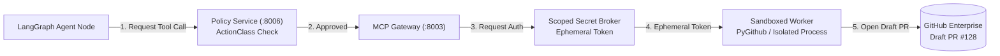

# ADR 009: MCP Gateway Isolation & Zero-Trust Ephemeral Secret Brokerage

## Status
**ACCEPTED** (2026-09-15)

## Context
Directly exposing GitHub, Jira, or production cloud tokens to LLM context windows creates a severe security vulnerability (prompt injection, token exfiltration, or unintended destructive write operations). Furthermore, monolithic agents with direct shell execution capabilities can inadvertently modify or corrupt local environments.

## Decision
We decouple tool integration into a dedicated **Tool Integration Plane** governed by the **Model Context Protocol (MCP)** and a zero-trust policy engine:

1. **Strict Action Classification**:
   - `read`: Read-only queries (e.g., ticket reading, repo inspection).
   - `draft`: Creation of non-destructive artifacts (e.g., git branch, draft PR).
   - `deploy`: Production mutations, strictly blocked from agent automation without cryptographic human-in-the-loop (HITL) authorization.
2. **Ephemeral Secret Injection**: Tools execute within isolated subprocesses where secrets are injected into the environment strictly for the lifetime of the call and never echoed back to the LLM.
3. **Draft-Only GitHub Integration**: The platform is only authorized to submit `draft` pull requests; branch merges and deployments require external human sign-off.

## Consequences
### Positive
- Prompt injection cannot exfiltrate long-lived credentials.
- Accidental destructive mutations to production codebases or branches are mathematically prevented.
- Complete auditability of all tool invocations with cryptographic provenance logs.
