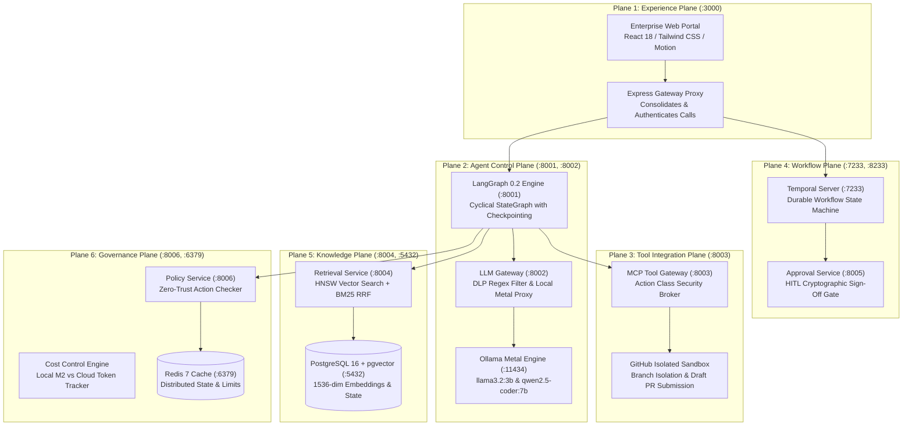
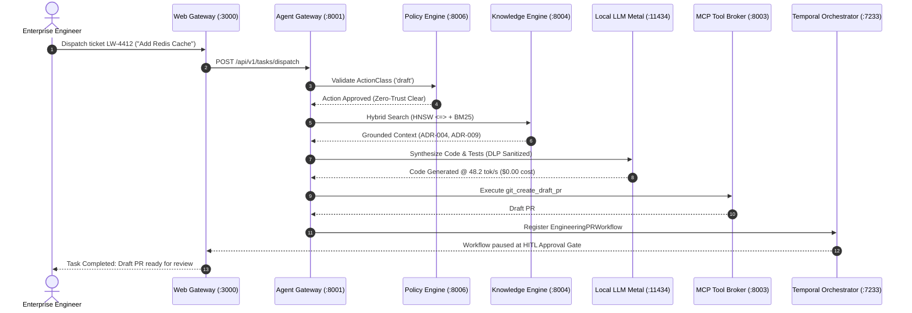

# Enterprise Solution Architecture: 6-Plane Decoupled Multi-Agent Platform

## 1. Executive Architecture Summary

`light-weight-agentic-engineering` is an enterprise architecture pattern engineered for local execution on **Apple Silicon (M2)** hardware with zero external token leakage, zero API subscription costs, and verifiable human-in-the-loop governance.

The platform decouples agentic capabilities across six isolated architectural planes:

---

## 2. Decoupled Plane Responsibilities

| Plane | Port / Interface | Technology | Architectural Invariant |
| :--- | :--- | :--- | :--- |
| **1. Experience** | `3000` (HTTP) | React 18, Vite, Express | User interaction only; cannot invoke tools or execute raw code directly. |
| **2. Agent Control** | `8001`, `8002` (FastAPI) | LangGraph 0.2, Ollama Metal | Cyclical graph traversal with deterministic node checkpoints in Postgres. |
| **3. Tool Integration** | `8003` (JSON-RPC) | Model Context Protocol | Zero-trust token injection; tools execute in isolated subprocess sandboxes. |
| **4. Workflow** | `7233`, `8005` (gRPC/HTTP)| Temporal.io, Python SDK | Multi-day durability, automatic retries, and strict HITL release gates. |
| **5. Knowledge** | `8004`, `5432` (SQL/asyncpg)| pgvector, PostgreSQL 16 | Grounded RAG with 1536-dim HNSW vector similarity + BM25 full-text rank fusion. |
| **6. Governance** | `8006`, `6379` (FastAPI) | OPA Rules, Redis 7 | Enforces RBAC permissions before any tool action is scheduled. |

---

## 3. End-to-End Orchestration Sequence

