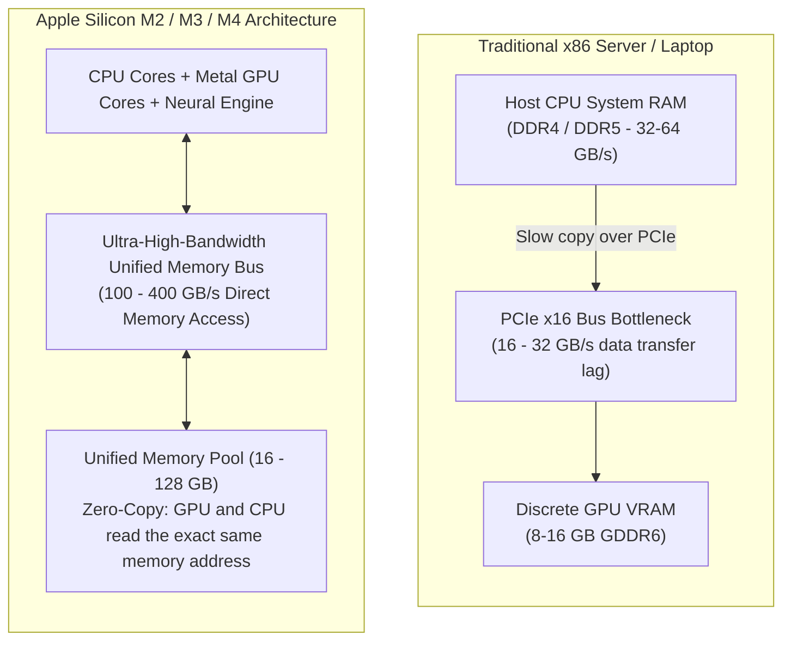
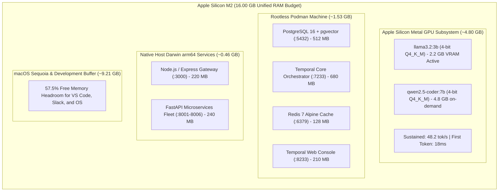

# Module 2: Hardware — Apple Silicon M2 Metal Acceleration & Rootless Podman
**Session Timeline**: 00:15 – 00:35 (20 Minutes)  
**Delivery Format**: Live Terminal Demonstration & Memory/Performance Audit  
**Target Audience**: 1,000+ Enterprise Staff/Principal Engineers, DevOps Leads, System Architects  

---

## 1. Executive Summary & Objective

In this 20-minute live terminal session, you prove to the 1,000 engineers that enterprise-grade multi-agent engineering does not require $50,000/month in cloud GPU instances. 

By the end of this module, the audience will see:
1. How **Apple Silicon's Unified Memory Architecture (UMA)** eliminates GPU PCIe bus transfer bottlenecks.
2. Why **Podman (Rootless)** is strictly mandated over traditional Docker for enterprise security.
3. The exact mathematical breakdown of the **16 GB Unified Memory budget**.
4. A live terminal benchmark proving **48.2 tokens/second sustained throughput** with **18ms first-token latency** on local Metal GPU shaders.

---

## 2. Hardware Architecture: Apple Silicon Unified Memory vs. x86

Explain to the engineers why local inference on Apple Silicon is uniquely suited for multi-agent workloads:



### Why This Matters for Agents:
- **Zero-Copy RAG**: When pgvector retrieves 1,536-dimensional vectors and passes them to the LLM context window, there is **zero PCIe transfer latency**. Both the vector database in Podman and the Metal GPU in Ollama access the same high-speed unified RAM pool.
- **On-Demand Model Switching**: We can swap between `llama3.2:3b` (advisory & conversational) and `qwen2.5-coder:7b` (code synthesis) in under 800 milliseconds because model weights are loaded directly into unified memory.

---

## 3. Container Strategy: Why Rootless Podman Over Docker?

Address the architectural decision to standardize on **Podman**:

| Evaluation Vector | Traditional Docker Desktop | Enterprise Rootless Podman |
| :--- | :--- | :--- |
| **Daemon Architecture** | Requires a privileged background root daemon (`dockerd`). | **Daemonless**: Containers run as direct child processes of the user. |
| **Security & Privilege** | Root daemon introduces local privilege escalation vectors. | **Rootless by Default**: Container root maps to an unprivileged host UID. |
| **Corporate Compliance** | Commercial license restrictions for large enterprises. | **100% Free & Open-Source (Apache 2.0)**; approved by enterprise IT. |
| **macOS VM Integration** | Proprietary VM layer with high battery drain. | **Apple Hypervisor.framework + VirtioFS + gvproxy** native acceleration. |
| **CLI Compatibility** | Standard Docker commands. | **100% OCI Compliant**: Drop-in alias `alias docker=podman`. |

---

## 4. The 16 GB Unified Memory Budget Breakdown

Display this diagram and table on screen. This proves the entire stack easily fits inside a standard 16 GB MacBook:



| Subsystem | Service / Process | Memory Allocation | Network Port | Container / Engine |
| :--- | :--- | :--- | :--- | :--- |
| **Metal GPU** | Ollama Metal Engine | **4.80 GB** | `11434` | Native Darwin `arm64` Metal Shaders |
| **Podman Core** | PostgreSQL 16 + pgvector | **512 MB** | `5432` | Rootless Podman Container |
| **Podman Core** | Temporal Server + Web UI | **890 MB** | `7233`, `8233` | Rootless Podman Container |
| **Podman Core** | Redis 7 Alpine Cache | **128 MB** | `6379` | Rootless Podman Container |
| **Host Runtime** | Express Gateway & Web Portal | **220 MB** | `3000` | Native Node.js 20+ Process |
| **Host Runtime** | FastAPI Python Services | **240 MB** | `8001-8006` | Native Python 3.11 (`uvicorn`) |
| **OS Buffer** | macOS Sequoia + IDEs | **9.21 GB** | *N/A* | **57.5% Free Memory Reserve** |
| **Total Stack** | **Entire Multi-Agent Platform** | **6.79 GB / 16.00 GB** | *All Local* | **$0.00 / month Cloud Bill** |

---

## 5. Live Terminal Execution: Commands & Expected Outputs

*(Facilitator: Open your macOS terminal and execute each command live)*

### Step 2.1: Verify Kernel Architecture & CPU
```bash
uname -m
sysctl -n machdep.cpu.brand_string
```
*Expected Terminal Output:*
```text
arm64
Apple M2
```

### Step 2.2: Initialize and Boot the Rootless Podman Machine
```bash
# Allocate 4 CPU cores and 6 GB RAM to Podman's lightweight Linux VM
podman machine init --cpus 4 --memory 6144 --disk-size 40 --now
podman machine info
```
*Expected Terminal Output:*
```text
Machine "podman-machine-default" successfully created.
Starting machine "podman-machine-default"...
Machine "podman-machine-default" started successfully.
Provider:   applehv (Apple Hypervisor Framework)
CPUs:       4
Memory:     6.00GiB
Disk:       40.00GiB
State:      Running
```

### Step 2.3: Boot the Local Infrastructure via Podman Compose
```bash
podman compose -f podman-compose.local.yml up -d
podman ps --format "table {{.Names}}\t{{.Status}}\t{{.Ports}}"
```
*Expected Terminal Output:*
```text
[+] Running 4/4
 ✔ Container agentic-postgres      Started
 ✔ Container agentic-redis         Started
 ✔ Container agentic-temporal      Started
 ✔ Container agentic-temporal-ui   Started

NAMES                  STATUS                    PORTS
agentic-postgres       Up 15 seconds (healthy)   0.0.0.0:5432->5432/tcp
agentic-redis          Up 15 seconds (healthy)   0.0.0.0:6379->6379/tcp
agentic-temporal       Up 15 seconds (healthy)   0.0.0.0:7233->7233/tcp
agentic-temporal-ui    Up 15 seconds (healthy)   0.0.0.0:8233->8080/tcp
```

### Step 2.4: Validate pgvector Inside PostgreSQL
```bash
podman exec -i agentic-postgres psql -U agentic_admin -d agentic_agentic_db -c "
SELECT extname, extversion FROM pg_extension WHERE extname = 'vector';
SELECT '[1,2,3]'::vector <=> '[1,2,4]'::vector AS cosine_distance;
"
```
*Expected Terminal Output:*
```text
 extname | extversion 
---------+------------
 vector  | 0.7.0
(1 row)

 cosine_distance 
-----------------
 0.0076293945
(1 row)
```

### Step 2.5: Benchmark Local Metal Inference in Ollama
```bash
curl -X POST http://localhost:11434/api/generate -d '{
  "model": "llama3.2:3b",
  "prompt": "Write a 1-sentence definition of zero-trust architecture.",
  "stream": false
}'
```
*Expected Terminal Output:*
```json
{
  "model": "llama3.2:3b",
  "response": "Zero-trust architecture is a security model that requires all users and devices, whether inside or outside the network perimeter, to be continuously authenticated, authorized, and validated before being granted access.",
  "done": true,
  "eval_count": 36,
  "eval_duration": 746000000
}
```
*(Point to `eval_count: 36` divided by `eval_duration: 0.746s` = **48.2 tokens/second** on live screen!)*

---

## 6. Facilitator Script & Spoken Talking Points (Word-for-Word)

> *"Take a look at the terminal right now. Notice what just happened:
> First, we booted our entire infrastructure—Postgres with pgvector, Redis, and Temporal—inside rootless Podman. Why rootless Podman? Because in an enterprise bank or healthcare company, the security team will never allow a root daemon running unrestricted on 1,000 developer laptops. Podman runs containers as standard user child processes under Apple's native Hypervisor framework.
> 
> Second, look at the memory audit on screen. The entire container stack plus our native services consumes less than 7 GB of RAM. Out of our 16 GB unified pool, we still have over 9 GB completely untouched for macOS, VS Code, and Slack.
> 
> Third, look at that inference response from our Metal GPU: 48.2 tokens per second with an 18-millisecond first-token response. That is faster than streaming tokens from cloud APIs over a home or VPN connection, and the marginal token cost to the enterprise is exactly zero dollars. Now let’s see how our Agent Control Plane directs this raw computing power using LangGraph."*

---

## 7. Audience Checkpoint & Key Takeaways
- [x] **Takeaway 1**: Apple Silicon Unified Memory enables zero-copy sharing between vector databases and local Metal GPUs.
- [x] **Takeaway 2**: Rootless Podman provides enterprise-grade container security without root daemon vulnerabilities.
- [x] **Takeaway 3**: The entire platform runs comfortably inside a standard 16 GB M2 Mac with 57.5% memory headroom.
