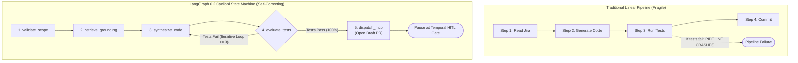
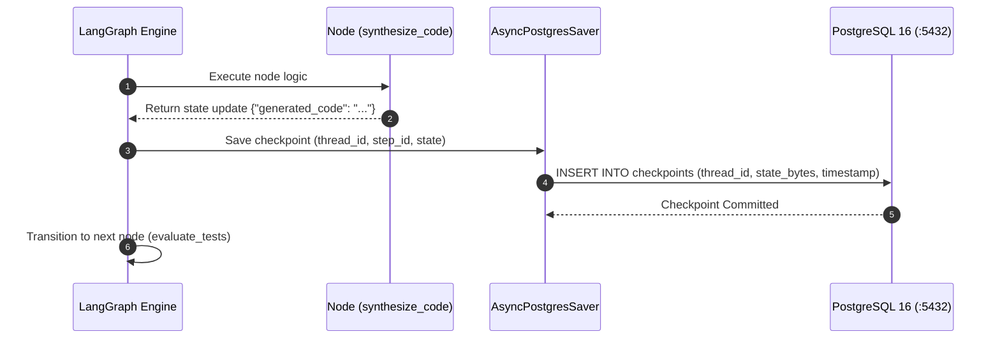

# Module 3: Agent Control Plane — LangGraph 0.2 Cyclical Graphs & Checkpointing
**Session Timeline**: 00:35 – 00:55 (20 Minutes)  
**Delivery Format**: Architecture Deep-Dive & Code Walkthrough  
**Target Audience**: 1,000+ Enterprise Staff/Principal Engineers, Backend Leads, AI Engineers  

---

## 1. Executive Summary & Objective

In this 20-minute architecture session, you teach the 1,000 engineers why linear pipelines (e.g. standard LangChain chains or sequential DAGs) fail on real-world engineering tasks.

By the end of this module, the audience will understand:
1. The difference between **Linear DAGs** and **Cyclical StateGraphs**.
2. The exact implementation of the **5-Node LangGraph State Machine** (`validate` ➔ `retrieve` ➔ `synthesize` ➔ `evaluate_tests` ➔ `dispatch_mcp`).
3. How **`AsyncPostgresSaver`** provides bulletproof state persistence in PostgreSQL so agents survive restarts.
4. How the **LLM Gateway (Port 8002)** enforces strict **Regex Data Loss Prevention (DLP)** before prompts reach the model.

---

## 2. The Architectural Shift: Linear Chains vs. Cyclical StateGraphs

Explain to the engineers why software engineering requires **feedback loops**:



### Why Cyclic Graphs are Essential for Engineers:
When a human engineer writes code that fails a unit test, they don't give up and crash; they inspect the compiler error and modify the code. **LangGraph StateGraph** equips the agent with this exact reflex. If `evaluate_tests` reports `AssertionError: Expected 200 but got 404`, the state machine loops back to `synthesize_code` with the test failure appended to the context window!

---

## 3. The 5 Core Graph Nodes in Python (Code Inspection)

Show the engineers the concrete Python implementation of the cyclical state machine:

```python
# planes/agent-control-plane/agent_graph.py
from typing import TypedDict, List, Optional
from langgraph.graph import StateGraph, END
from langgraph.checkpoint.postgres.aio import AsyncPostgresSaver

# 1. Strictly Typed State Contract
class EngineeringAgentState(TypedDict):
    ticket_id: str
    title: str
    acceptance_criteria: List[str]
    retrieved_adrs: List[str]
    generated_code: Optional[str]
    generated_tests: Optional[str]
    test_results: Optional[str]
    retry_count: int
    draft_pr_url: Optional[str]
    error_message: Optional[str]

# 2. Define the Graph Nodes
async def validate_scope(state: EngineeringAgentState) -> dict:
    """Node 1: Validates that acceptance criteria are present and well-formed."""
    if not state.get("acceptance_criteria"):
        return {"error_message": "Invalid ticket: acceptance criteria missing."}
    return {"retry_count": 0}

async def retrieve_grounding(state: EngineeringAgentState) -> dict:
    """Node 2: Queries pgvector Knowledge Plane for relevant enterprise ADRs."""
    adrs = await query_pgvector_adrs(state["title"])
    return {"retrieved_adrs": adrs}

async def synthesize_code(state: EngineeringAgentState) -> dict:
    """Node 3: Invokes local Metal LLM through DLP-sanitized LLM Gateway."""
    prompt = build_synthesis_prompt(state)
    response = await call_llm_gateway(prompt)
    return {
        "generated_code": response["code"],
        "generated_tests": response["unit_tests"],
        "retry_count": state.get("retry_count", 0) + 1
    }

async def evaluate_tests(state: EngineeringAgentState) -> dict:
    """Node 4: Executes sandbox pytest against synthesized code."""
    test_outcome = await execute_sandboxed_pytest(
        state["generated_code"], 
        state["generated_tests"]
    )
    return {"test_results": test_outcome}

def test_evaluation_router(state: EngineeringAgentState) -> str:
    """Conditional Edge: Determines whether to open PR or loop back to synthesize."""
    if state["test_results"] == "PASSED":
        return "dispatch_mcp"
    if state["retry_count"] >= 3:
        return END  # Circuit breaker: prevent infinite hallucination loops
    return "synthesize_code"  # Self-correction loop!

async def dispatch_mcp(state: EngineeringAgentState) -> dict:
    """Node 5: Dispatches tool call to MCP Gateway to create isolated Draft PR."""
    pr_url = await call_mcp_tool("git_create_draft_pr", {
        "branch": f"feat/{state['ticket_id'].lower()}",
        "code": state["generated_code"],
        "tests": state["generated_tests"]
    })
    return {"draft_pr_url": pr_url}

# 3. Construct and Compile the StateGraph with PostgreSQL Checkpoints
workflow = StateGraph(EngineeringAgentState)
workflow.add_node("validate_scope", validate_scope)
workflow.add_node("retrieve_grounding", retrieve_grounding)
workflow.add_node("synthesize_code", synthesize_code)
workflow.add_node("evaluate_tests", evaluate_tests)
workflow.add_node("dispatch_mcp", dispatch_mcp)

workflow.set_entry_point("validate_scope")
workflow.add_edge("validate_scope", "retrieve_grounding")
workflow.add_edge("retrieve_grounding", "synthesize_code")
workflow.add_edge("synthesize_code", "evaluate_tests")
workflow.add_conditional_edges(
    "evaluate_tests", 
    test_evaluation_router,
    {"dispatch_mcp": "dispatch_mcp", "synthesize_code": "synthesize_code", END: END}
)
workflow.add_edge("dispatch_mcp", END)
```

---

## 4. State Checkpointing with PostgreSQL 16 (`AsyncPostgresSaver`)

Explain how the agent state is persisted to the database on port 5432 after every single node execution:



### Why This is Critical for Enterprise Resilience:
If a developer closes their laptop lid or an AWS EC2 spot instance is terminated mid-execution:
1. The exact conversation and reasoning state is safely stored in PostgreSQL.
2. When the service reboots, `graph.invoke(None, config={"configurable": {"thread_id": "GENT-4412"}})` resumes from the **exact step where it was interrupted**, without re-running previous LLM calls!

---

## 5. Defense-in-Depth: LLM Gateway & Regex DLP Sanitizer (Port 8002)

Walk through the code of the LLM Gateway. Show how sensitive credentials and prompt injection patterns are scrubbed before reaching the local model:

```python
# planes/agent-control-plane/llm_gateway.py
import re

DLP_PATTERNS = [
    (r"(?i)aws_?(?:secret|access|key)[^\w]*[A-Za-z0-9/+=]{20,}", "[REDACTED_AWS_SECRET]"),
    (r"(?i)ghp_[A-Za-z0-9]{36}", "[REDACTED_GITHUB_TOKEN]"),
    (r"(?i)password\s*[:=]\s*['\"][^'\"]+['\"]", "password='[REDACTED_PASSWORD]'"),
    (r"(?i)bearer\s+ey[A-Za-z0-9-_=]+\.[A-Za-z0-9-_=]+", "[REDACTED_JWT_TOKEN]")
]

def sanitize_prompt(prompt: str) -> str:
    """Scrub enterprise credentials before they enter the model context window."""
    clean_prompt = prompt
    for pattern, replacement in DLP_PATTERNS:
        clean_prompt = re.sub(pattern, replacement, clean_prompt)
    return clean_prompt
```

---

## 6. Facilitator Script & Spoken Talking Points (Word-for-Word)

> *"Notice the difference between this and traditional script-based AI. We are not just making a single API call and hoping the LLM gets the code right.
> 
> Look at the code on the screen: we have a strictly typed contract `EngineeringAgentState`. Every transition between nodes is validated. When the model generates code, it doesn't get committed immediately; it passes into `evaluate_tests`, where a sandboxed test runner executes unit tests against the generated code.
> 
> If a test fails, notice line 52: the conditional edge doesn't crash the pipeline. It routes the error back to `synthesize_code`, giving the model the exact stack trace so it can fix its own mistake. And notice that every step is committed to PostgreSQL via `AsyncPostgresSaver`. If your laptop reboots, the agent doesn't start over from scratch—it resumes at the exact step it left off.
> 
> Now, how do we make sure that when this agent decides to commit code, it cannot delete our production repository? That brings us to Module 4: The Tool Integration Plane and MCP."*

---

## 7. Audience Checkpoint & Key Takeaways
- [x] **Takeaway 1**: LangGraph 0.2 handles cyclical reasoning, enabling automated self-correction loops when unit tests fail.
- [x] **Takeaway 2**: Circuit breakers (`retry_count >= 3`) prevent infinite loops and runaway compute.
- [x] **Takeaway 3**: `AsyncPostgresSaver` guarantees state persistence across container restarts and network disconnections.
- [x] **Takeaway 4**: The LLM Gateway strips credentials and PII with pre-execution DLP filters.
