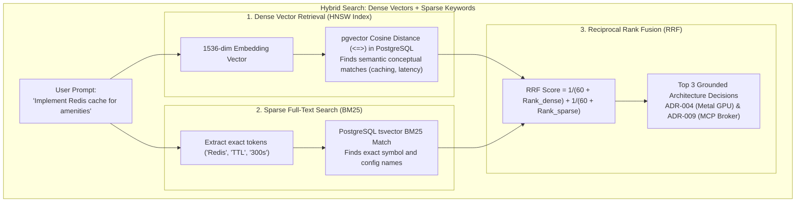
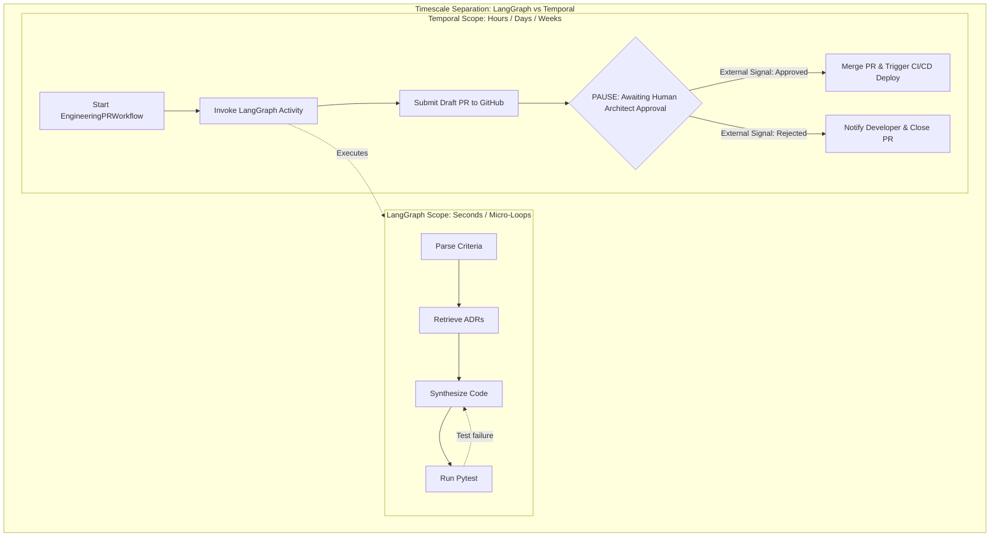

# Module 5: Knowledge Plane & Workflow Durability (pgvector & Temporal.io)
**Session Timeline**: 01:15 – 01:35 (20 Minutes)  
**Delivery Format**: SQL Vector Inspection, Temporal Workflow Deep-Dive & HITL Gate Demo  
**Target Audience**: 1,000+ Enterprise Staff/Principal Engineers, Data/AI Architects, Lead Developers  

---

## 1. Executive Summary & Objective

In this 20-minute module, you demonstrate how to ground agents in institutional enterprise knowledge and how to orchestrate multi-day workflows that survive machine reboots:

1. **Grounded RAG with pgvector**: Combining **1,536-dimensional HNSW cosine similarity** with **BM25 full-text rank fusion** to retrieve company Architecture Decision Records (ADRs).
2. **Temporal.io Durable State Machines**: Why engineering workflows cannot rely on in-memory timers, and how Temporal manages asynchronous, multi-day Human-in-the-Loop (HITL) code review gates.
3. **Crash Resilience**: Proving that when a laptop reboots or a worker container restarts, Temporal resumes execution seamlessly without losing progress.

---

## 2. Knowledge Plane: Hybrid Search with pgvector & BM25

Explain why standard naive RAG (vector-only) produces hallucinations on software engineering codebases:



### The SQL Implementation in PostgreSQL 16 (Podman):
Show the engineers the actual SQL query executed by the Knowledge Retrieval Service on Port 8004:

```sql
-- Executed inside agentic-postgres container (Port 5432)
WITH dense_matches AS (
    SELECT id, title, content, 
           ROW_NUMBER() OVER (ORDER BY embedding <=> $1::vector) AS dense_rank
    FROM architecture_decision_records
    ORDER BY embedding <=> $1::vector
    LIMIT 20
),
sparse_matches AS (
    SELECT id, title, content,
           ROW_NUMBER() OVER (ORDER BY ts_rank_cd(to_tsvector('english', content), plainto_tsquery('english', $2)) DESC) AS sparse_rank
    FROM architecture_decision_records
    WHERE to_tsvector('english', content) @@ plainto_tsquery('english', $2)
    LIMIT 20
)
SELECT COALESCE(d.id, s.id) AS doc_id,
       COALESCE(d.title, s.title) AS title,
       COALESCE(d.content, s.content) AS content,
       (COALESCE(1.0 / (60 + d.dense_rank), 0.0) + 
        COALESCE(1.0 / (60 + s.sparse_rank), 0.0)) AS rrf_score
FROM dense_matches d
FULL OUTER JOIN sparse_matches s ON d.id = s.id
ORDER BY rrf_score DESC
LIMIT 3;
```

---

## 3. Workflow Plane: Why Temporal.io for Multi-Day Engineering Workflows?

Address the fundamental difference between **LangGraph** (micro-reasoning) and **Temporal** (macro-durability):



### The Problem Temporal Solves:
- In the real world, a Pull Request is not merged in 5 seconds. It sits waiting for a Senior Architect to review it. That review may take **3 days**.
- If your agent is a Python script with `sleep(259200)`, what happens when the container crashes, when the node restarts, or when memory leaks? The script dies, and the PR state is lost.
- **With Temporal.io**, the workflow state is completely persisted in PostgreSQL. The worker consumes **0 MB of CPU** while waiting. When the human clicks "Approve", Temporal wakes up the exact line of code and continues execution!

---

## 4. The Python Temporal Workflow Definition (Code Inspection)

Show the engineers how easy it is to write durable state machines using Temporal's Python SDK:

```python
# planes/workflow-plane/workflows/engineering_pr_workflow.py
from datetime import timedelta
from temporalio import workflow

with workflow.unsafe.imports_passed_through():
    from activities.agent_activities import run_langgraph_task, open_draft_pr, notify_developer

@workflow.defn
class EngineeringPRWorkflow:
    def __init__(self):
        self.is_approved = False
        self.rejection_reason = None

    @workflow.signal
    def approval_signal(self, approved: bool, reason: str = ""):
        """External Human-in-the-Loop Signal Handler."""
        self.is_approved = approved
        self.rejection_reason = reason

    @workflow.run
    async def run(self, ticket_payload: dict) -> dict:
        # Step 1: Run LangGraph agent synthesis as a durable activity (with auto-retries)
        agent_result = await workflow.execute_activity(
            run_langgraph_task,
            ticket_payload,
            start_to_close_timeout=timedelta(minutes=5)
        )

        # Step 2: Open Draft PR on GitHub via MCP Tool activity
        pr_result = await workflow.execute_activity(
            open_draft_pr,
            agent_result,
            start_to_close_timeout=timedelta(minutes=2)
        )

        # Step 3: PAUSE WORKFLOW until human architect signs off (Can wait days!)
        await workflow.wait_condition(lambda: self.is_approved is not None)

        if not self.is_approved:
            await workflow.execute_activity(notify_developer, f"PR Rejected: {self.rejection_reason}")
            return {"status": "REJECTED", "reason": self.rejection_reason}

        # Step 4: Promote and merge PR to production
        return {
            "status": "APPROVED_AND_MERGED",
            "pr_url": pr_result["pr_url"],
            "workflow_id": workflow.info().workflow_id
        }
```

---

## 5. Live Inspection: PostgreSQL pgvector & Temporal Web Console

*(Facilitator: Show these terminal queries and browser dashboards)*

### Step 5.1: Query ADR Citations Directly from PostgreSQL (Podman)
```bash
podman exec -i agentic-postgres psql -U agentic_admin -d agentic_agentic_db -c "
SELECT id, title, category FROM architecture_decision_records LIMIT 3;
"
```
*Expected Terminal Output:*
```text
   id    |                     title                      |   category    
---------+------------------------------------------------+---------------
 ADR-004 | Apple Silicon Metal GPU Acceleration for LLMs  | Hardware
 ADR-007 | Distributed Caching Strategy with Redis        | Architecture
 ADR-009 | MCP Gateway Isolation & Scoped Secret Broker   | Security
(3 rows)
```

### Step 5.2: Open Temporal Web Console
Navigate browser to: `http://localhost:8233`
- Show the visual execution tree for `EngineeringPRWorkflow`.
- Point to the state badge: `Status: WAITING_FOR_HITL_APPROVAL`.
- Point to the activity history: notice that every input, output, duration, and retry attempt is logged for compliance auditability!

---

## 6. Facilitator Script & Spoken Talking Points (Word-for-Word)

> *"Take a look at the architectural pairing here.
> First, look at how we retrieve context. We don't just dump all documentation into an LLM and hope it doesn't hallucinate. We run hybrid search directly in PostgreSQL using pgvector. We combine 1,536-dimensional semantic embeddings with BM25 keyword matching using Reciprocal Rank Fusion. This guarantees that when the model generates code, it cites ADR-004 and ADR-007 as mathematical provenance.
> 
> Second, look at Temporal. Every developer in this room has written code where an asynchronous process crashed because someone restarted a server or a network socket disconnected.
> 
> Look at line 28 of our Temporal workflow: `await workflow.wait_condition(lambda: self.is_approved)`. This single line of code can pause for 5 minutes, 5 hours, or 5 days. During that entire time, the worker consumes no memory, no CPU, and no cloud dollars. The state is safe in PostgreSQL.
> 
> And when the Release Architect inspects the pull request and clicks 'Approve', a cryptographic signal triggers that exact line of code to continue. That is what enterprise durability looks like.
> 
> Now, let’s tie all 6 planes together and run our live end-to-end demo in Module 6."*

---

## 7. Audience Checkpoint & Key Takeaways
- [x] **Takeaway 1**: Hybrid RAG (pgvector HNSW + BM25 RRF) produces grounded code that adheres strictly to enterprise ADRs.
- [x] **Takeaway 2**: Temporal.io decouples long-running business lifecycles from ephemeral container processes.
- [x] **Takeaway 3**: Human-in-the-Loop (HITL) gates halt workflows safely without polling or resource consumption.
- [x] **Takeaway 4**: Every workflow activity has complete cryptographic provenance and auditability.
