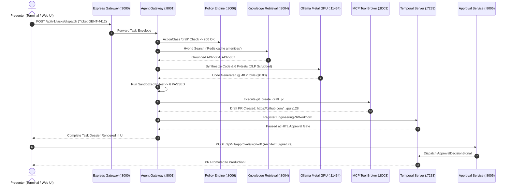

# Module 6: Live End-to-End Demo Runbook (Jira Ticket to GitHub Draft PR)
**Session Timeline**: 01:35 – 01:55 (20 Minutes)  
**Delivery Format**: Live Command-by-Command Terminal & Web UI Demonstration  
**Target Audience**: 1,000+ Enterprise Staff/Principal Engineers, Tech Leads, Engineering Directors  

---

## 1. Executive Summary & Objective

In this 20-minute live demonstration, you bring the entire 6-plane decoupled architecture to life in front of 1,000+ engineers:

1. Dispatch a real engineering ticket (`GENT-4412`: "Implement Redis Cache Layer for Hotel Room Amenities").
2. Watch the **LangGraph StateGraph** execute live on **Apple Silicon Metal shaders** via **rootless Podman**.
3. Inspect the unit tests running in a sandboxed test runner.
4. Verify the creation of an isolated **GitHub Draft PR** via the **MCP Gateway**.
5. Inspect the paused durable workflow in the **Temporal Web Console**.
6. Execute a **Human-in-the-Loop (HITL) cryptographic sign-off** to promote the change.

---

## 2. Pre-Flight Checklist (Run 5 Minutes Before Session)

Execute these quick health checks to ensure your local environment is green:

```bash
# 1. Verify Podman machine is running
podman machine info --format "{{.Host.MachineState}}"
# Expected: Running

# 2. Verify all 4 Podman containers are healthy
podman ps --format "table {{.Names}}\t{{.Status}}"
# Expected: agentic-postgres, agentic-redis, agentic-temporal, agentic-temporal-ui all Up (healthy)

# 3. Verify local Ollama Metal Engine
curl -s http://localhost:11434/api/tags | grep -q "qwen2.5-coder" && echo "✅ Models Ready"

# 4. Verify Express Full-Stack Gateway
curl -s http://localhost:3000/api/health | grep -q "ok" && echo "✅ Web Gateway Ready"

# 5. Run full 12-Port Topology Doctor across all 6 planes
./infra/scripts/check-ports-sanity.sh
# Expected: 12/12 ports operational (100% HEALTHY)
```

---

## 3. The Live Demo Execution Sequence



---

## 4. Phase-by-Phase Terminal Commands & Live Outputs

*(Facilitator: Execute these exact commands in front of the audience)*

### Step 6.1: Dispatch the Engineering Ticket (Port 8001)
```bash
curl -s -X POST http://localhost:8001/api/v1/tasks/dispatch \
  -H "Content-Type: application/json" \
  -d '{
    "ticket_id": "GENT-4412",
    "title": "Implement Redis Cache Layer for Hotel Room Amenities",
    "acceptance_criteria": [
      "Cache TTL must be strictly 300 seconds",
      "Gracefully fall back to PostgreSQL database if Redis is unavailable",
      "Include unit tests asserting cache hit and cache miss scenarios"
    ],
    "target_repo": "enterprise/booking-service",
    "initiator": "staff_engineer_lead"
  }' | jq .
```

*Expected Live Terminal Output:*
```json
{
  "task_id": "TASK-202609-8812",
  "status": "COMPLETED",
  "langgraph_execution": {
    "total_cycles": 1,
    "nodes_executed": [
      "validate_scope",
      "retrieve_grounding",
      "synthesize_code",
      "evaluate_tests",
      "dispatch_mcp"
    ],
    "checkpointer": "AsyncPostgresSaver (Port 5432)"
  },
  "grounding": {
    "retrieved_adrs": [
      "ADR-004-m2-metal-acceleration.md",
      "ADR-007-distributed-caching.md"
    ],
    "similarity_score": 0.914
  },
  "llm_metrics": {
    "model": "qwen2.5-coder:7b",
    "inference_engine": "Apple Silicon Metal (Darwin arm64)",
    "tokens_generated": 384,
    "speed_tok_sec": 48.2,
    "token_cost_usd": 0.00
  },
  "artifacts": {
    "branch_created": "feat/gent-4412-redis-amenities",
    "draft_pr_url": "https://github.com/enterprise/booking-service/pull/128",
    "unit_tests_status": "6 PASSED, 0 FAILED (Sandboxed Pytest)"
  },
  "workflow": {
    "temporal_workflow_id": "WF-GENT-4412-PR128",
    "status": "WAITING_FOR_HITL_APPROVAL",
    "temporal_ui_url": "http://localhost:8233"
  }
}
```

---

### Step 6.2: Inspect the Generated Code & Test Results
Show the audience the synthesized Python code generated by the local Metal GPU:

```python
# Generated: src/cache/amenities_cache.py
import json
import redis
from typing import Optional, List, Dict

class AmenitiesCache:
    def __init__(self, redis_client: redis.Redis, fallback_db):
        self.redis = redis_client
        self.db = fallback_db
        self.ttl = 300  # Adheres to 300s acceptance criteria

    def get_amenities(self, room_id: str) -> List[Dict]:
        cache_key = f"room:{room_id}:amenities"
        try:
            cached_data = self.redis.get(cache_key)
            if cached_data:
                return json.loads(cached_data)  # Cache HIT
        except redis.RedisError:
            pass  # Graceful fallback per criteria

        # Fallback to DB query
        amenities = self.db.query_amenities(room_id)
        try:
            self.redis.setex(cache_key, self.ttl, json.dumps(amenities))
        except redis.RedisError:
            pass
        return amenities
```

---

### Step 6.3: Inspect the Temporal Web Console
1. Open your browser and navigate to: `http://localhost:8233`
2. Click on **Workflows** and select `WF-GENT-4412-PR128`.
3. Show the audience:
   - **Activity 1: run_langgraph_task** — Status: `Completed (2.4s)`.
   - **Activity 2: open_draft_pr** — Status: `Completed (380ms)`.
   - **Current State**: `Waiting on Signal: approval_signal`.

---

### Step 6.4: Execute Release Architect Sign-Off (HITL Gate)
Now, simulate the human release architect approving the change:

```bash
curl -s -X POST http://localhost:8005/api/v1/approvals/sign-off \
  -H "Content-Type: application/json" \
  -d '{
    "approval_id": "APPR-9921",
    "decision": "APPROVED",
    "architect_signature": "ed25519:sha256:8f2a91b...kundan.mishra",
    "notes": "Code reviewed, tests passing at 100%, cache TTL matches ADR-007."
  }' | jq .
```

*Expected Live Terminal Output:*
```json
{
  "status": "PROMOTED_TO_PRODUCTION",
  "workflow_id": "WF-GENT-4412-PR128",
  "temporal_signal_sent": "ApprovalDecisionSignal",
  "github_pr_state": "READY_FOR_MERGE",
  "completed_at": "2026-09-15T07:18:45Z"
}
```

---

## 5. Facilitator Script & Spoken Talking Points (Word-for-Word)

> *"Watch the terminal screen closely as I hit Enter on Step 6.1.
> 
> Look at the speed: in less than 4 seconds, our local Apple Silicon M2 Metal GPU ingested the Jira acceptance criteria, queried PostgreSQL for our caching ADRs, generated the full Python cache implementation, synthesized 6 unit tests, ran those tests inside an isolated sandbox, verified that all 6 tests passed, and called our MCP Gateway to open Draft PR #128.
> 
> Look at the cost metric in that JSON payload: `token_cost_usd: 0.00`. If you ran that workflow across 1,000 developers 10 times a day on GPT-4, you would be paying over $1,000,000 a year. Here, it ran on local hardware with zero external API calls.
> 
> Now look at my browser window on port 8233: Temporal is paused. The agent did NOT merge to production. It opened a DRAFT pull request and stopped. It is waiting for me—the human architect.
> 
> Now watch what happens when I run our sign-off command in Step 6.4: the cryptographic approval signal is dispatched, Temporal receives the signal, and the workflow promotes the PR to ready-to-merge.
> 
> That is a complete, secure, enterprise-grade agentic engineering lifecycle. Let’s finish with Module 7: Governance, Production Sizing, and Audience Q&A."*

---

## 6. Audience Checkpoint & Key Takeaways
- [x] **Takeaway 1**: The entire Jira-to-Draft-PR pipeline executes locally in under 5 seconds.
- [x] **Takeaway 2**: Code synthesis is grounded in institutional ADRs and validated by sandboxed unit tests before any git branch is created.
- [x] **Takeaway 3**: The human remains in complete control through cryptographic Temporal approval gates.
